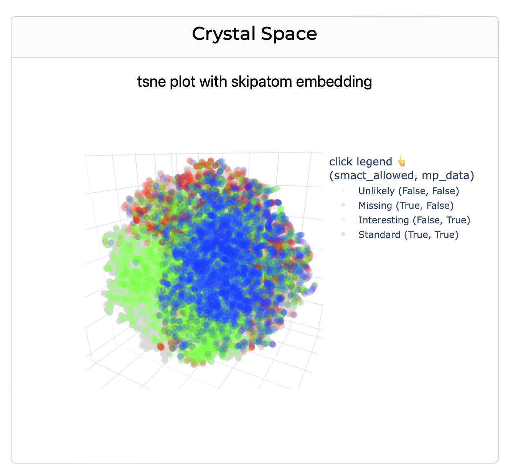

<div align="center">

<h1> Crystal Space 🔮 </h1>

  <p>
    <strong>Mapping Crystal Space for Binary Compounds</strong>
  </p>

</div>

## Features
- Visualisation of binary element combinations generated using [SMACT](https://github.com/WMD-group/SMACT)
- 6 element embedding schemes (magpie, mat2vec, megnet16, oliynyk, skipatom, random) provided by [ElementEmbeddings](https://github.com/WMD-group/ElementEmbeddings)
- 3 dimensionality reduction techniques (PCA, TSNE, UMAP)
- 3D interactive plots with crystal structures (where available from Materials Project)

 

## Installation

```bash
git clone https://github.com/WMD-group/CrystalSpace.git
cd CrystalSpace
pip install -r requirements.txt
```

## Usage

- Help Command

```bash
python app.py --help
```

- Run the app with specific ip and port

```bash
python app.py --host=0.0.0.0 --port=8050
```

## Publication

"Mapping inorganic crystal chemical space" H. Park, A. Onwuli, K. T. Butler and A. Walsh, [Faraday Discussions (2024)](https://pubs.rsc.org/en/content/articlelanding/2024/fd/d4fd00063c) 	

